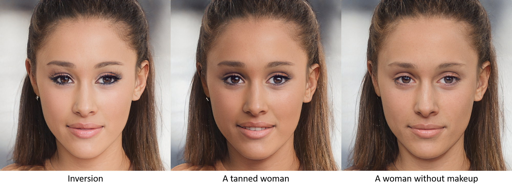

# Text-Guided Editing of Images (Using CLIP and StyleGAN)

[](http://colab.research.google.com/github/orpatashnik/StyleCLIP/blob/main/playground.ipynb)

This repo contains a code and a few results of my experiments with StyleGAN and CLIP. Let's call it StyleCLIP. 
Given a textual description, my goal was to edit a given image, or generate one.
The following diagram illustrates the way it works:


In this example, I took an image of Ariana Grande, inverted it using [e4e](https://github.com/omertov/encoder4editing),
 and edited the image so Ariana will look more tanned, using the text "A tanned woman".
 To keep the image close to the original one, I also used a simple L2 loss between the optimized latent vector and the original one.

I tried to apply edits that cannot be done with common traversal in latent space, for example, using celebs names as target direction (see below)!
I hope you can be more creative.

Try, it is really fun. (Hope you will enjoy it like I did!)

### Editing Examples

Here are some examples, and first of all, some manipulated images of myself :)
The description I used to obtain each edited image is written above or below it.


And now a few celebs. The description I used to edit each image is written below it.




### Setup

The code relies on the official implementation of [CLIP](https://github.com/openai/CLIP), 
and the [Rosinality](https://github.com/rosinality/stylegan2-pytorch/) pytorch implementation of StyleGAN2.
Some parts of the StyleGAN implementation were modified, so that the whole implementation is native pytorch.

#### Requirements
- Anaconda
- Pretrained StyleGAN2 generator (can be downloaded from [here](https://drive.google.com/file/d/1EM87UquaoQmk17Q8d5kYIAHqu0dkYqdT/view?usp=sharing))

In addition, run the following commands:
  ```shell script
conda install --yes -c pytorch pytorch=1.7.1 torchvision cudatoolkit=<CUDA_VERSION>
pip install ftfy regex tqdm
pip install git+https://github.com/openai/CLIP.git
```


### Usage

Given a textual description, one can both edit a given image, or generate a random image that best fits to the description.
Both operations can be done through the `main.py` script, or the notebook.

#### Editing
To edit an image set `--mode=edit`. Editing can be done on both provided latent vector, and on a random latent vector from StyleGAN's latent space.
It is recommended to adjust the `--l2_lambda` according to the desired edit. 
From my experience, different edits require different values of this parameter.

#### Generating Free-style Images
To generate a free-style image set `--mode=free_generation`.

